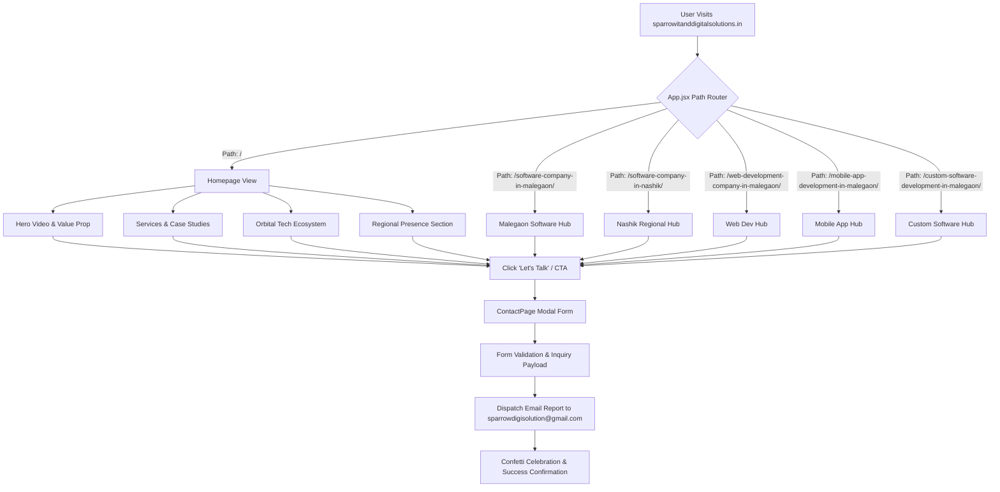

# 🚀 Sparrow IT & Digital Solutions — Technical Documentation & Architecture

Welcome to the official repository for **Sparrow IT & Digital Solutions** ([sparrowitanddigitalsolutions.in](https://sparrowitanddigitalsolutions.in)).

This document provides a comprehensive overview of the **Technology Stack**, **Project Architecture**, **Component Flow**, **Data Pipelines**, and **SEO & Infrastructure Configuration**.

---

## 🛠️ 1. Technology Stack

### **Core Framework & Runtime**
- **React 19 (`react` ^19.2.8, `react-dom` ^19.2.8)**: Modern component architecture utilizing hooks, state management, and optimized render cycles.
- **Vite 8 (`vite` ^8.2.0, `@vitejs/plugin-react` ^6.0.4)**: Next-generation frontend build tool providing Lightning-fast Hot Module Replacement (HMR) and optimized ES module bundling.

### **Styling & Design System**
- **Tailwind CSS v4 (`tailwindcss` ^4.3.3, `@tailwindcss/vite` ^4.3.3)**: Utility-first CSS engine.
- **Haptiq Enterprise Color Palette**: Sleek deep navy theme `#0A2540`, `#092B80`, `#38BDF8`, and glassmorphism styling.
- **Google Fonts**: `Plus Jakarta Sans` (Body & Headings), `Space Grotesk` (Subtitles & UI Elements), `JetBrains Mono` (Code & Micro-labels).
- **Lucide React (`lucide-react` ^1.31.0)**: Modern vector icon library.
- **Utilities**: `clsx` and `tailwind-merge` for dynamic class concatenation.

### **Animations & Micro-Interactions**
- **Framer Motion (`framer-motion` ^13.1.0)**: Hardware-accelerated spring animations, page transitions, and modal overlays.
- **Canvas Confetti (`canvas-confetti` ^1.9.4)**: Interactive particle effects on form submission success.

### **Code Quality & Tooling**
- **Oxlint (`oxlint` ^1.75.0)**: High-performance Rust-based JavaScript/React linter.
- **Node.js (ES Modules)**: Native ESM configuration (`"type": "module"` in `package.json`).

### **Hosting & Infrastructure**
- **Vercel**: Global Edge Network hosting.
- **Custom Domain**: `https://sparrowitanddigitalsolutions.in/`
- **SPA Rewrite Configuration (`vercel.json`)**: Serves `index.html` for clean route URLs.

---

## 📁 2. Project Structure & Directory Layout

```
d:\Sparrow\
├── public/                     # Static Public Assets
│   ├── favicon.svg             # Official Sparrow Soaring Wing Icon (Tab Favicon)
│   ├── sparrow-logo.svg        # Official Vector Logo Mark (1:1 Square)
│   ├── sparrow-logo.png        # High-Res Transparent PNG Logo (1024x1024)
│   ├── sparrow-wordmark.svg    # Official Vector Brand Wordmark
│   ├── sparrow-wordmark.png    # High-Res Transparent PNG Wordmark
│   ├── og-image.jpg            # Social Open Graph Card Image
│   ├── robots.txt              # Search Crawler Permissions
│   └── sitemap.xml             # XML Sitemap with Canonical URLs
├── scripts/
│   └── generate-assets.js      # Asset Generation Script
├── src/
│   ├── assets/                 # Video & Image Media Files
│   │   └── hero-bg.mp4         # High-Definition Hero Background Video
│   ├── components/             # React Component Library
│   │   ├── Navbar.jsx          # Fixed Top Navigation Bar
│   │   ├── Hero.jsx            # Video Hero Section
│   │   ├── TrustSection.jsx    # Capabilities & Tech Ticker
│   │   ├── ServicesSection.jsx # Core Services Grid
│   │   ├── ProjectsShowcase.jsx# Real Case Studies Showcase
│   │   ├── OrbitalEcosystem.jsx# Animated Rotating Tech Stack
│   │   ├── FeaturedSolutions.jsx# Integrated Platform Cards
│   │   ├── HowWeWork.jsx       # 4-Step Engineering Process
│   │   ├── ImpactSection.jsx   # Business Metrics & ROI Cards
│   │   ├── UseCaseSection.jsx  # Client Segment Cards
│   │   ├── MalegaonSEOSection.jsx# Regional Hub Section
│   │   ├── InsightsSection.jsx # Engineering & Growth Articles
│   │   ├── FinalCTA.jsx        # Pre-Footer Call to Action
│   │   ├── Footer.jsx          # Deep Navy Footer & Policy Modals
│   │   ├── ContactPage.jsx     # Contact Form & Email Dispatch
│   │   ├── ProductDetailPage.jsx# Full-Screen Project Case Study View
│   │   ├── SparrowLogo.jsx     # Reusable Vector Brand Logo Component
│   │   ├── LetsTalkButton.jsx  # Reusable Animated CTA Button
│   │   ├── SoftwareCompanyMalegaon.jsx # Dedicated Malegaon Landing Page
│   │   ├── SoftwareCompanyNashik.jsx   # Dedicated Nashik Landing Page
│   │   ├── WebDevMalegaon.jsx          # Dedicated Web Dev Landing Page
│   │   ├── MobileAppMalegaon.jsx       # Dedicated Mobile App Landing Page
│   │   └── CustomSoftwareMalegaon.jsx  # Dedicated Custom Software Page
│   ├── App.jsx                 # Central App Switcher & SPA Router
│   ├── main.jsx                # React Mount Entry Point
│   └── index.css               # Tailwind CSS Entry File
├── index.html                  # Main HTML Document & Meta Schema
├── package.json                # Project Dependencies & Scripts
├── vercel.json                 # Vercel SPA Routing Configuration
└── vite.config.js              # Vite Build Configuration
```

---

## 🔄 3. Application Flow & User Journeys



### **A. SPA Routing Flow (`App.jsx`)**
- Uses native `window.location.pathname` and `window.history.pushState` to transition smoothly between pages without hard browser reloads.
- Handles browser Back/Forward navigation seamlessly via `popstate` event listeners.

### **B. Mobile Video Preloading Flow (`Hero.jsx`)**
- HTML5 Video source is configured with `${heroVideo}#t=0.001`, `preload="auto"`, and `playsInline`.
- Forces mobile WebKit (Safari/Chrome on iOS & Android) to render the first frame immediately, eliminating initial black box glitches.

### **C. Automated Contact Form Flow (`ContactPage.jsx`)**
- Users fill out project details (Name, Email, Phone, Service Choice, Project Budget, Message).
- Submits structured inquiry data to `sparrowdigisolution@gmail.com`.
- Triggers confetti animation on success.

---

## 🎯 4. Regional SEO & Schema Architecture

### **Geographic Hierarchy**
1. **Primary Hub**: Malegaon, Maharashtra
2. **Regional Hub**: Nashik & Nashik District
3. **State Presence**: Maharashtra
4. **Broad Market**: India & Remote Client Capabilities

### **Schema.org Structured Data (JSON-LD in `index.html`)**
- **Type**: `["ProfessionalService", "Organization"]`
- **Name**: `Sparrow IT & Digital Solutions`
- **Alternate Names**: `["Sparrow IT and Digital Solutions", "Sparrow IT", "Sparrow Digital"]`
- **Area Served**: Malegaon, Nashik, Maharashtra, India
- **Contact**: `+91-8421477238`, `+91-8806413189`
- **Catalog**: Custom Web Apps, Mobile Apps, Enterprise ERPs, Meta Ads, Google Ads

---

## ⚡ 5. Build & Development Commands

```bash
# 1. Install dependencies
npm install

# 2. Start local development server
npm run dev

# 3. Build production bundle
npm run build

# 4. Preview production build locally
npm run preview
```

---

## 🔒 6. Infrastructure & Deployment Rules

1. **Vercel Rewrites**: Configured in `vercel.json` so deep links like `/software-company-in-malegaon/` render `index.html` seamlessly.
2. **GitHub Deployment Workflow**: Pushes to `main` branch trigger automatic production builds on Vercel.
